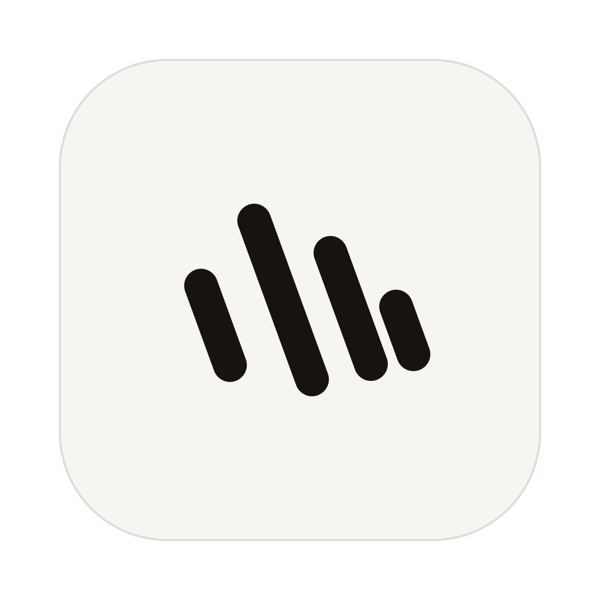
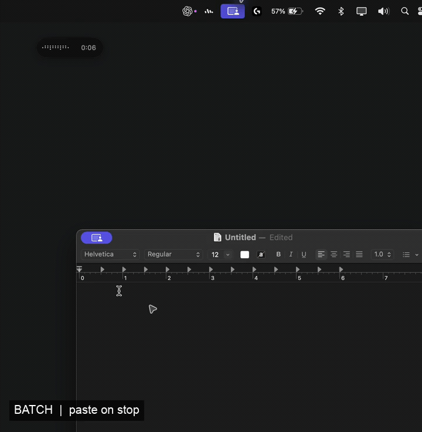

# Murmur

<p align="center">
  
</p>



Murmur is a local macOS menu bar dictation app. Speak, and your words appear where you are typing.

- **Batch** transcribes a complete recording and pastes the finished text when you stop.
- **Overlay** shows a rough transcript while you speak and pastes the cleaned result when you stop.
- **Inline** pastes finalized phrases as you speak.

Transcription and transcript handling always run on this Mac; audio and transcript text stay on-device. Internet access is used to download speech and polish models and to check for and download app updates. Microphone and Accessibility permissions are needed for recording and automatic paste.

## Install

Murmur runs on macOS 14 or newer. Building requires Xcode 16.3 or newer with Swift 6.1+. Xcode 16.3 requires macOS Sequoia 15.2 or newer to run; the app's deployment target remains macOS 14.

Before the first build, set up a stable local signing identity. This prevents macOS from treating every rebuild as a different app and discarding its Microphone and Accessibility grants:

1. Open Xcode → Settings → Accounts and add your Apple ID.
2. Select the account, choose Manage Certificates, and create an Apple Development certificate.
3. Verify that `security find-identity -v -p codesigning` lists it.

Then install from Terminal:

```sh
git clone https://github.com/jackammon/murmur.git
cd murmur
bash scripts/install.sh
```

The installer builds and signs Murmur, replaces `~/Applications/Murmur.app`, verifies the signature, and launches it. A free Apple ID is sufficient for a local Apple Development certificate; a paid Developer Program membership is only needed to distribute a notarized build to other Macs.

If no signing identity is available, the installer stops before building and explains how to add one. For a one-off build where permission resets are acceptable, explicitly allow ad-hoc signing:

```sh
MURMUR_ALLOW_ADHOC=1 bash scripts/install.sh
```

On first launch, Murmur guides you through Microphone and Accessibility access. On macOS versions where Accessibility becomes enabled before synthetic paste events become active, Murmur shows a Restart button and resumes onboarding after relaunch. You can also continue without automatic paste; transcripts remain on the clipboard.

The speech model has two first-run stages: Downloading saves the model weights, then Preparing loads the tokenizer and compiles the model for the Mac. Murmur reports it as ready only after both stages finish. The files live under `~/Library/Application Support/Murmur`; Murmur does not probe or migrate a cache in Documents.

To build a DMG instead, run `bash scripts/package_dmg.sh`. Sharing it with another Mac still requires Developer ID signing and Apple notarization.

### Clean uninstall

Remove only the app:

```sh
bash scripts/uninstall.sh
```

For a fresh-install test, remove the app plus downloaded models, history, settings, caches, and permission grants:

```sh
bash scripts/uninstall.sh --all-data
```

## Development

The app is tested on macOS 14 and newer with Swift 6.1+. `scripts/wrap_app.sh` creates a signed app bundle, `scripts/install.sh` installs it locally, and `scripts/package_dmg.sh` packages it as a disk image.

```sh
swift test
bash scripts/wrap_app.sh
open build/Murmur.app
```

## Troubleshooting

If recording does not start, check the Permissions section in Murmur Settings and System Settings → Privacy & Security → Microphone. If text does not appear at the cursor, check Accessibility in the same section. When Murmur says a restart is required, use the onboarding Restart button or quit and reopen the app once.

If permissions reset after every rebuild, check the signature requirement:

```sh
codesign -dr - "$HOME/Applications/Murmur.app"
```

An output containing only `cdhash` is an ad-hoc signature. Run the normal installer after adding an Apple Development certificate. A self-signed Code Signing certificate named `Murmur Dev` is also supported for local use, but it does not replace Developer ID signing or notarization for distribution.
